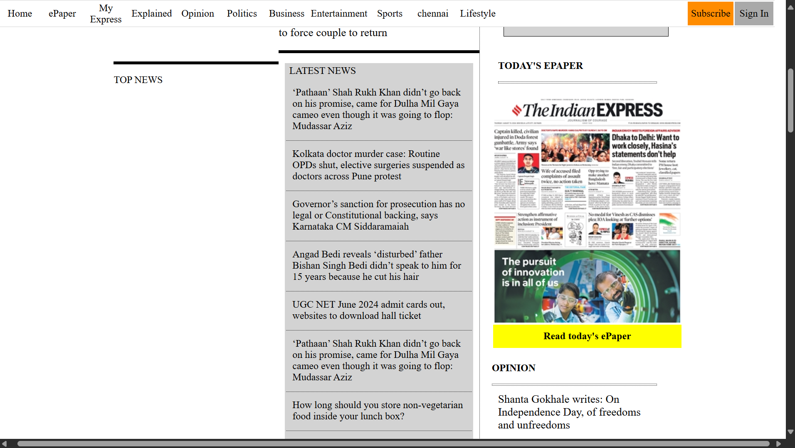
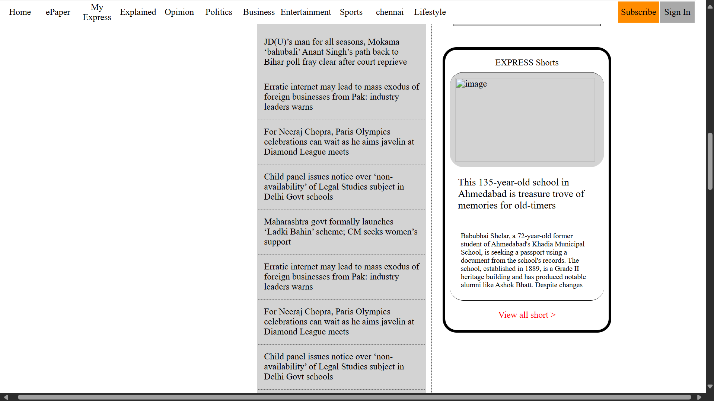

## IndianExpress Website 
✔️ This source file was show website layout 


## Technologies Used
- HTML
- CSS 
- JavaScript

## Installation
1. Clone the repository:
   ```bash
   git clone https://github.com/GOKUL988/The-Indian-Express-Website.git
   ```
2. Navigate to the project folder:
   ```bash
   cd The-Indian-Express-Website
   ```

## Sample Images 

##

##

##


